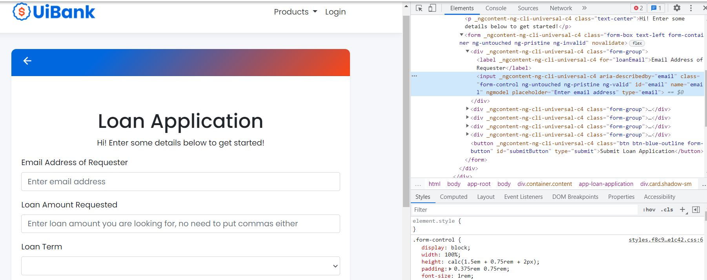

# UiBank_Test_Selenium

This type of testing using Selenium depends completely on Web elements structure.
It could loose the track of elements and testers should always indicate them according to the id in the element html code after inspecting.
a delay should be taken in consideration if the html source code is not uploaded immediately. 

